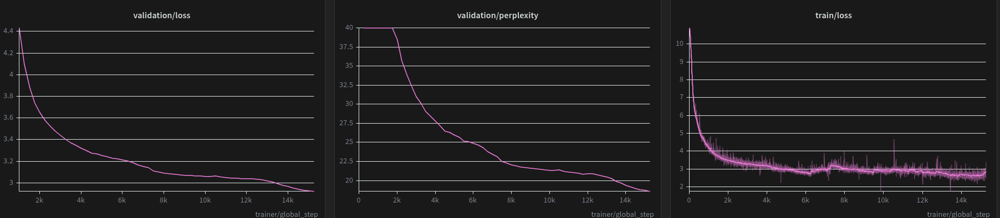

Two major improvements have been achieved in those days thanks to the 20M/2B and 100M/2B runs.
In both, the models start giving correct answers e.g. Recognizing that the capital of France is Paris, that Jupyter is the largest planet in the solar system. 
In particular, the 100M model shows a significantly better capability of continuing the text after the continuation is provided. 

The models tets have been obviously carried on using the same temperature, top k, top p params, using a fully deterministic model (temp=0, top p=1, top k=0). Now i'm running another test suite using temperature=1, top p=0.9, top k=20 to see how a more stochastic model behaves. I'm doing this because i feel like the greedy sampling is mainly responsible of "endless repetitions" after the true answer has been provided by the model. For example, after correctly responding "The Pacific Ocean" to the question "What's the largest ocean on Earth?", the 100M 2B model would simply repeat "Question: What is the name of the largest ocean on Earth? Answer: The Pacific Ocean". I would like to find out wether this repetition is caused by the model being forced of greedily choosing the most likely token. Gonna be a fun comparison.

In the meanwhile, i'm wiring the next test, staying consistent with the "scale data until no more improvement is on sight" principle: the next run is gonna be 100M/10B. Observing training graphs, there's clearly much room for validation improvement. Maybe not enough to justify 5x more tokens, but I mean we're not paying for GPUs are we?

Speaking about GPUs, we wired Kaggle training to use both T4. We can forget 60k tokens/second that our Modal's H100 achieves on the 100M model, but it's gonna be a nice plan b. 

---
Good news! The temp=1 test went pretty well and proved two important points:
1. No more repetition loop, but rather "senseful gibberish"*. Of course, higher temperature and top k mean more possible tokens to choose from, and less probability of falling into producing the same trigrams.
2. Unexpectedly, more correct answers! 4 (or 5 if we consider that a french word followed by "paris" accounts as a correct answer to "what's the capital of France") versus the 2 of the deterministic test. 100% profit!

***PROMPT**:"The rain had stopped before dawn, leaving the streets covered in "
**CONTINUATION**:"iced coffee.\n\nSo, what did the kids get out and eat, the parents didn't know, did?\n\nAnd the parents did not know how much to do. So, the parents had no clue how they got out and had a problem.\n\nThey didn't know, but the children was a little sick. They did not know how to handle them and didn't know if this was going to happen.\n\nThe parents knew that, right now, the kids have been in the area for around three weeks and there has been a significant increase in kids. They said that when kids get out and eat,",

I mean, it doesn't make much sense, but the deterministic test's answer was ""ices. The rain was still wet, and the sun was shining. The rain was still wet, and the sun was shining. The rain was still wet, and the sun was shining. The rain was still wet, and the sun was shining. The rain was still wet, and the sun was shining. The rain was still wet, and the sun was shining. The rain was still wet, and the sun was shining. The rain was still wet, and the sun was shining. The rain was still wet, and the sun was shining. The rain was still wet, and the sun was shining. The rain was still wet,"

If i had to choose, i'd say the first one makes much more sense, doesn't it? I mean, it tells you a story at least :)

