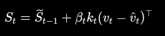
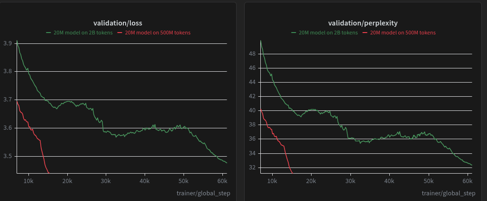
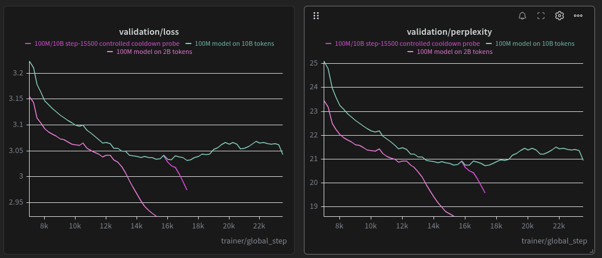
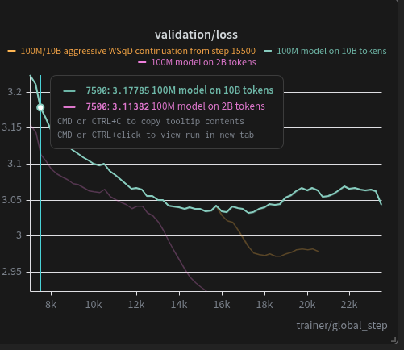

The 100M/10B run is quite disappointing:

I mean, how's that even possible? The most likely answer is how we handle learning rate. A similar behavior wasreported during the 20M run, comparing 2B vs 500M:

To investigate this phenomenon, we're gonna run a small test: take the 100M snapshot at step 12500 (that's where we clearly see 2B and 10B runs performances deviating) and resume the training from that point with a heavier lr decaying: in both 100M/2B and 20M/500M runs, the heavy decrease in val loss is caused by triggering of heavy lr decay. It looks we misprogrammed LR scheduling to happen correctly also on longer runs.

Unfortunately, the 12500 update is gone: we made HF squash the commits to keep only best and last update, but Beam still has 15500 one, which is close enough to test this anyway. We'll start the LR cooldown from there and see what happens.

---
The 15500 proved our point:

LR during most of the run has been too high for running a fair training, pushing the weights away from the minimum. 
To solve this, we'll changing our LR scheduling policy: once the warmup ends, a gentle decay starts, bringing the lr down to around -60% with until roughly the 10% of the remaining update stepd. At that point another decay starts, aiming at lowering the lr down to roughly -90% compared  to the initial value.
---
Appearently we celebrated too early:

The rise of loss coincides with the end of "fast" weight decay. This suggests we need a more aggressive decay. This 10B run is cosing us two/three Beam accounts, lol. Anyway, since this topic will come back sooner or later, I started another run with a much more aggressive decay, and we'll see how fur it goes. That's kinda science right?

---

With all this mess I almost forgot that we had the fine tuned 100M 2B model waiting for us. I tested it, and it's quite fun to play with—better than I expected! It is also very fast after you compile the Triton kernels for the first time on a device.
 