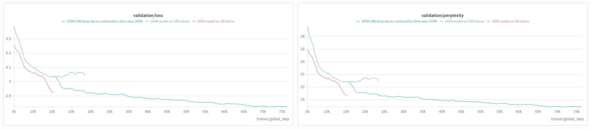

The 100M/10B run is done! It took only 15 days, 3x Kaggle accounts, 3x beam accounts and 3x modal accounts. Lol.

Our Aggressive lr proved to be kinda right, even though our model is now a Frankenstein. It might be worth re training it all wiht a constant lr policy, but I feel like we shouldn't waste basically all our monthly compute to repeat the run, as we're not even close to be done with it. 
Anyway, the loss graph, showing a flat behavior during the last update steps, suggests we squeezed most of it out of the model. It'll be interesting to compare it when we'll re train it. It'll basically be New Game +.
About the results: the model behaves substantially better than is parent 2B, not only because the non greedy sampling version is finally able to guess "Portuguese" as the brazilian language, but also in terms of prose writing:

prompt: The rain had stopped before dawn, leaving the streets covered in 
continuation: iced water. The people of the village were not able to get out of the water, and the water was too cold to drink.\n\nThe village was...

It doesn't make much sense on its own, but it prints an image in you mind right? It could be a true prose scenario. 

Just for a fun comparison, I gave GPT 2-S (124M trained on roughly 10B) the same prompt:
" snow.

"I'm not sure if I'm going to be able to get out of here," said the woman, who asked not to be named.

The woman said she was driving to the airport to get her daughter to school.

"I'm not sure if I'm going to be able to get out of here," she said.

The woman said she was driving to the airport to get her daughter to school.

"I'm not sure if I'm going to be able to get out of here," she said."

Much more repetition than us, on a similar parameters and training tokens count. I see it as an absolute win! 